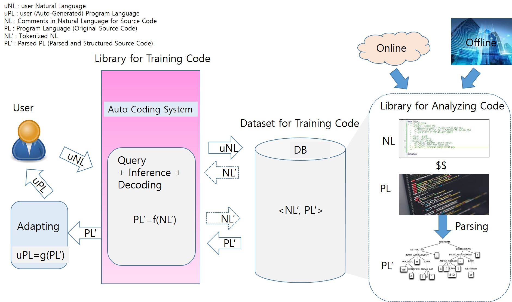

# autocode_dataset

Building a database infrastructure that can be used for additional research of software generation by learning and analyzing codes, documents, and metadata in the source code repository in the future

>- Database storage technology that can be used for program creation/SW analysis

>- Information model technology for generating program source code and improving accuracy of expression

>- Database technology with a structure that facilitates the addition/deletion of source codes within the company

>- Description of code generation evaluation method reflecting actual needs such as code search, summary, and completion

# Image

