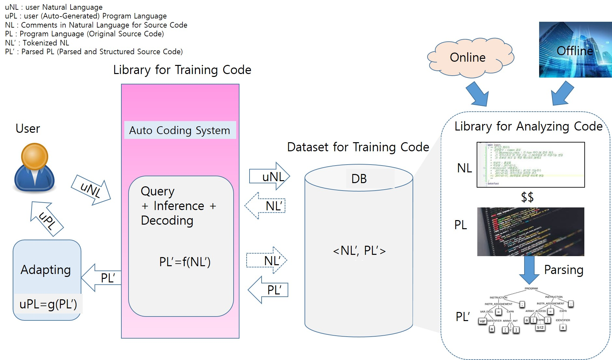

# Storage (autocode_dataset)

Building a database infrastructure that can be used for additional research of software generation by learning and analyzing codes, documents, and metadata in the source code repository in the future

>- Database storage technology that can be used for program creation/SW analysis

>- Information model technology for generating program source code and improving accuracy of expression

>- Database technology with a structure that facilitates the addition/deletion of source codes within the company

>- Description of code generation evaluation method reflecting actual needs such as code search, summary, and completion

# Overview 

# Requirements of Source Code Infrastructure

>- Multiple source code collection systems provided by multiple organizations must be provided. 
   Currently, Sungkyunkwan University and Suresoft company are in charge of collecting source codes, and the relevant institutions must collect and store data sets according to some guidelines.

>- A system that individually processes the collected source codes must be provided. 
   In addition, source code and natural language should be processed so that they can be easily and immediately used in a third form such as AST or PDG, 
   which can structurally reflect the control and data flow of the program, rather than being stored as they are.

>- It has a data set in which the collected source code and natural language are stored in the form of a database, 
   and a system for using the source code data set that can be extracted from outside using a specific API must be provided.

>- A inter-conversion system between NL and PL must be provided for automatic generation of ML-based source code

>- Automatic generation system of ML-based source code must provide multiple most appropriate source codes

>- When a user makes a query using NL, a function that converts the automatically generated source code to suit the user's environment must be provided.

>- The automatic source code generation system must be provided in the API form so that third parties can easily use it from the outside.

# Crawling Code for Github Project
>- GithubCrawling

This directory contains source code for searching GitHub projects and crawling the source code within those projects. Although the target source codes are in C/C++ and Python, there is no language restriction if the code is modified accordingly.

# Dataset Description
>- CodeSearchNet-Python

This directory contains an augmented dataset based on Python source code from the CodeSearchNet dataset. The original dataset consists of natural language (problem):code pairs, and in this version, the natural language part has been enhanced. In addition to the original problem description, we added solution strategies and pseudocode to enrich the natural language component. This augmented dataset can help improve the ability to find the correct code solutions for given problems.

>- Github-Cpp-2024

This directory contains C/C++ source codes that were crawled, filtered, and collected from GitHub. In particular, during the filtering process, the source codes were scored, and low-quality codes were removed. Additionally, the natural language descriptions for the codes were generated using an LLM, resulting in a complete dataset in the form of (natural language : code) pairs.

>- MutMut

The MutMut dataset was created by applying minor code mutations using a mutation testing tool, with the goal of generating faulty code that fails to pass test cases. These mutations involve various techniques, such as renaming variables, changing operators, and modifying statements—typically at the line level. By applying these transformations to an existing dataset, a collection of buggy code samples was produced.

